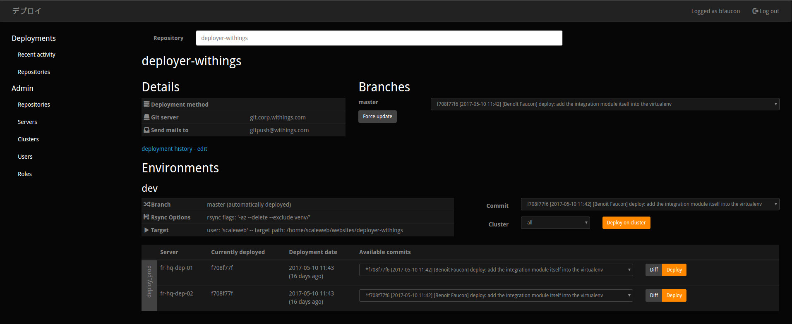

# Deployer

A simple yet effective web service to deploy code from Git repositories.

This tool was developed at Withings (now part of Nokia Technologies France), where it powers about a hundred deployments per day during business hours, on more than a hundred hosts.
It is designed for simplicity, ease of operation (for sysadmins), and ease of use (for developers).




## Overview

The deployer is targeted at environments where:
* Linux is the only operating system used
* you use Git
* the bulk of most deployments is simply a `rsync`, with some pre- and post-deployment scripts (integration
  with your build system is also possible)
* you have less than a couple hundred hosts, and they do not change too often
* you have less than 20 servers per environment, where environment means a dev/staging/production environment
  for one given Git repository
* you have a clear distinction between users with full administrative rights, and users who can just deploy
  code: this model will not scale well for big teams (> 30 persons ?)

It requires Python 2.7, a SQL database, and SSH access to the target hosts. That's about it (fine print
below).

The frontend is a Javascript application written in Redux + React ; to use it, you will need an external
authentification service (details also below).

### Notable features

* agentless: only use SSH access
* deployment history and audit per repository
* fine grained access control per environment (dev/staging/prod...): read-only access, deploy during business hours only (currently hardcoded), deploy at any time
* optional HAProxy integration to put servers in maintenance in HAProxy during a deployment
* complete web API
* a realtime web UI built on top of this API
* easy to deploy and operate
* simple (but not scalable) active-active redundancy when put behind a HTTP load-balancer
* deployments on each push (via a Git hook)
* various notification methods: email and Graphite support are built-in, and you can write your own

### Integration within your infrastructure

To integrate the deployer within your infrastructure, you need to:
* provide access to a [SQLAlchemy supported database](http://docs.sqlalchemy.org/en/latest/dialects/index.html)
* provide access to a [beanstalkd](http://kr.github.io/beanstalkd/) server:
  this is an historical dependency and may be removed in the future
* (optional but strongly recommended) write a small Python plugin to tell it how to authenticate an user. The default uses a
  username/password combination, but you may want to authenticate against an external service instead.
* (optional) to use the "autodeploy" feature: write a Git hook that call a deployer API on each push
* (optional) to use the HAProxy support feature: credentials to access the the HAProxy API

### Project status

The deployer is used in production daily in a small team at Nokia Technologies, but beware: its open-source journey is fairly recent,
the code could use come cleanup (it has a long history :) ), and both the UI and the API have some rough edges.
That said, it has proven reliable, and we think it could be of use to others, so here we are.

It is stable enough that backward-compatibility should not be an issue, but we make no guarantees about that.

Documentation is incomplete, but you should have enough to get started and figure things by yourself.
You can get an idea of what the deployer is capable of by playing with the web UI.
Otherwise, you'll need to read the code.

Contributions are welcome. Feel free to ask questions or report issues with Github issues.


## Quick start

These instructions are for Ubuntu 14.04, adapt as needed.

### Get the code

```
git clone git@github.com:nokia/nokia-deployer.git
cd nokia-deployer
```

### Web frontend (optional, but highly recommended)

You can run this on a build server and copy the resulting files.

```
# Install NodeJS (tested with version 4, more recent versions probably work too)
echo 'deb https://deb.nodesource.com/node_4.x trusty main' > /etc/apt/sources.list.d/nodejs
curl -s https://deb.nodesource.com/gpgkey/nodesource.gpg.key | apt-key add -
sudo apt-get update
sudo apt-get install nodejs npm

# Install gulp
sudo npm install -g gulp

# Configure the build
cp build.config.sample.js build.config.js
$EDITOR build.config.js

# Build the frontend
# This will populate the folders `web/static/js` and `web/static/html`.
gulp build
```

### Server and workers (Python)

```
# Install virtualenv
sudo apt-get install python-pip
sudo pip install virtualenv

# Create and activate the virtualenv
virtualenv venv -p $(which python2.7)
source venv/bin/activate

# Install the deployer and its dependencies
pip install -e '.[full]'

# Edit the default configuration
cp deployer.sample.ini deployer.ini
$EDITOR deployer.ini

# Run the deployer
# This single invocation will run all processes required for the deployer.
deployer -c deployer.ini run
```

## Deployment considerations

### SSH access

The user that the deployer will connect as is a per-environment configuration variable.
You need to setup passwordless SSH for this user for each target server.

### Access control

#### Authentication

The deployer can support two authentication methods:
* username + password
* sessionid

There are no fundamental differences between the two. The sessionid method is intended to be used with an
external authentication method, while the username + password method is easier to use if you don't want
to implement integration with another service.

Out-of-the box (using the `deployment.integration.DummyIntegration` module), the deployer provides
authentification by username + password (sometimes referred to 'token-based' authentification, the token being the password).
Note that this is not supported by the web UI ; to use the web UI, you will need to write a sessionid
authentication plugin.

See the source for `deployment/integration/DummyIntegration.py` for details.

In its database, the deployer stores two identifying fields for each user:
* accountid (this is a user ID, but called accountid because of historical reasons)
* password (hashed by default, and can be null if you don't want to use this authentication method)

Prior to making requests, a client must get a session token from the deployer, using one of the two
methods above. The session token must then be provided under the "X-Session-Token" HTTP header on each HTTP request, and is
only valid for a couple of minutes.

The web UI only implements the sessionid authentification workflow (at least for now).

##### sessionid authentification

This method relies on a "sessionid" provided by an external authentication service.
This sessionid is exchanded using a HTTP POST request to `/api/auth/wssession` against a deployer token.

To use this method, you need to write a small Python plugin to match this sessionid against one of the accountid
stored in the deployer database.
This plugin will need to talk to the external authentication service to validate the sessionid and retrieve the corresponding accountid.

Once the accountid is retrieved, the deployer will issue a short-lived session token to the client. The client will then
provide this token in each request (under the `X-Auth-Token` header) to authenticate its requests.

The web UI only supports this authentication method. During the login flow, cookies are sent to the deployer API.
The API will then pick the value stored in the sessionid cookie. If the authentication against the external
service fails, the web UI will users to your authentication service login page.

This assumes that the deployer and your authentication service are hosted on the same domain.

#### Authorization

Users have roles, and each role has a set of permissions on specific environments.

The admin permission is special and allow all actions, including configuring repositories and environments, and
adding users.

In order to make writing bots easier, the "impersonate" permission allows a client to use the permissions
of another user. Thread with care.

The deployer can limit deployments outside business hours. "Business hours" are currently hardcoded, and match
8:00 - 18:30 local time, plus most French bank holidays.

### Security

The access control provided by the deployer is not intended to be used against untrusted users (no
security analysis has been done).
Websocket access in particular is not yet correctly restricted, but can only give partial read-only access.

Repositories are trusted ; they can contain executable scripts that will be run by the deployer.

### Logging

The deployer writes its logs to /dev/log (syslog format) and stdout.

### Monitoring

Each deployer instance has a "/health" endpoint that will return an HTTP 500 Internal Server Error if it
detects something fishy.

### Process management

You should run the deployer under some kind of process management ; we provide an example Upstart file
(deployer.conf). The deployer does not provide any option to be run as a background process, as process
managers do that better.

### API documentation

Sorry, you will have to read the code for now. The API is kinda RESTful if you don't look too closely.
The web UI should allow you to perform all day-to-day actions.

### Deployment scripts

Deployed repositories can contain the following scripts:
* `predeploy.sh`: run with the user the deployer is running as, on the same server as the deployer, before the
  deployment. Can be used as a poor man build system.
* `tests/run_local_tests.sh`: run in the same conditions as the predeploy.sh script
* `deploy.sh`: run on each target server, after the deployment
* `tests/run_tests.sh`: run in the same conditions as the deploy.sh script

These scripts will receive some parameters as CLI args (repository name, environment, server...).

## Developing

### Frontend

`gulp dev` will set up a continous background build.

Some (most ?) parts of the frontend code are old and do not follow modern React or ES6 best practices.
Feel free to cleanup when you are working on these parts:
* use stateless components where possible
* clearer separation between presentational and logic components
* connect more components to Redux, rather than having a few root components passing state down
* remove unecessary use of refs (maybe use a form library?)
* use of ES6 syntax
* ...

### Backend

Run the unit test suite with `nosetests`. Unit test coverage is fairly limited, so you will also need to
perform manual integration testing (and write more tests).


## Alternatives

We are not aware of a lot of easy to operate, self-hosted open-source alternatives with a similar feature set (that's why we built this deployer).

One of the closest alternatives is probably [deployinator](https://github.com/etsy/deployinator). Written in Ruby, this tool shares most of our ideas about how a deployment process should look like.

If you have scalability requirements that the deployer can not handle, you should have a look at [Teletraan](https://github.com/pinterest/teletraan).

## License

Copyright (C) 2016 Nokia Corporation and/or its subsidiary(-ies).
Licensed under the Apache License, Version 2.0. See the LICENSE file for details.
